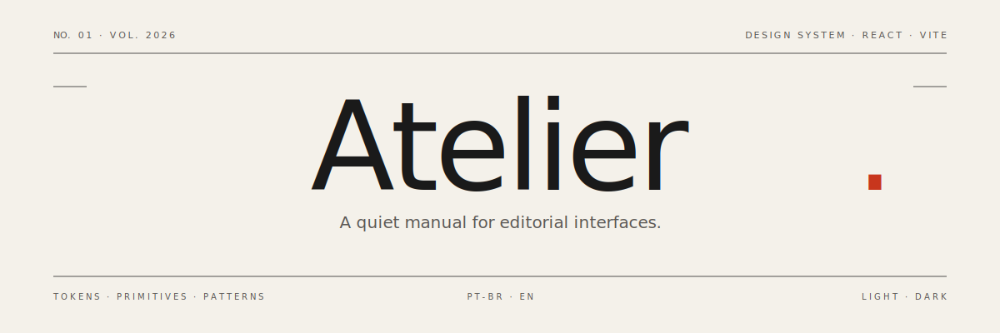

<p align="center">
  
</p>

<p align="center">
  <a href="https://react.dev"></a>
  <a href="https://vitejs.dev"></a>
  
  
  
  
</p>

# Atelier — Design System

> A quiet manual for editorial interfaces.

Atelier is a design system built with React and Vite, drawing its visual
language from printed magazines and architecture books — warm paper tones,
dark ink, a red used like a margin note. Two typefaces — [Fraunces][fraunces]
and [JetBrains Mono][mono] — carry almost the entire hierarchy. Nothing is
rounded; nothing is decorative.

[fraunces]: https://fonts.google.com/specimen/Fraunces
[mono]: https://fonts.google.com/specimen/JetBrains+Mono

## Stack

- **React 18** + **Vite 5** — no external router (lightweight hash routing).
- **Fraunces** + **JetBrains Mono** (Google Fonts).
- **Plain CSS** with CSS variables as design tokens.
- Zero runtime dependencies beyond `react` and `react-dom`.

## Getting started

```bash
npm install
npm run dev
```

The app opens at `http://localhost:5173` (or the next free port).
Available scripts:

```bash
npm run dev       # start the dev server
npm run build     # build for production (outputs to dist/)
npm run preview   # preview the production build
```

## Highlights

- **Bilingual by default** — `pt-BR` and `en` dictionaries, swappable at
  runtime via `useT()`. Lightweight markup parsing ([acc], [em]) for inline
  emphasis inside translations.
- **Two themes** — `light` and `dark`. First visit follows the OS
  `prefers-color-scheme`; every choice after is persisted in `localStorage`.
- **Two navigation modes** — a vertical **sidebar** (default, with
  collapsible width and `⌘/Ctrl + B` shortcut) or a horizontal **navbar**
  with hover dropdowns. The user toggles between them; the preference is
  persisted.
- **Live specimens** — the `Sidebar` and `Navbar` documentation pages
  include faithful, interactive miniatures with numbered anatomy markers.
- **Global footer** — theme-aware, four columns driven by the i18n
  dictionary, plus social links.

## Pages

Twenty-two documented pages, grouped editorially:

| Group | Pages |
|---|---|
| **Start** | Overview, Principles |
| **Foundations** | Colors, Typography, Spacing, Glyphs |
| **Components** | Buttons, Fields, Controls, Badges, Avatars, Alerts, Cards, Tabs, Tables, Overlays, Feedback, Dropzone |
| **Patterns** | Forms, Empty States, Sidebar, Navbar |
| **Reference** | Code (tokens + primitives API) |

## Structure

```
src/
├── App.jsx                     # Shell: sidebar or navbar + content + footer
├── main.jsx
├── index.css                   # Tokens + utilities + DS components
├── components/
│   ├── Sidebar.jsx             # Vertical navigation (default)
│   ├── Navbar.jsx              # Horizontal navigation (alternative)
│   └── Footer.jsx              # Global site footer
├── ds/
│   ├── primitives.jsx          # Button, Field, Input, Badge, Avatar, ...
│   ├── AvatarPicker.jsx        # Upload + crop + preset gallery
│   └── avatarPresets.jsx       # Inline SVG avatar collection
├── i18n/
│   ├── pt-BR.js
│   ├── en.js
│   └── index.js
├── lib/
│   ├── i18n.jsx                # useT() + locale provider
│   ├── theme.jsx               # ThemeProvider (light/dark)
│   ├── routes.js               # Navigation map
│   ├── useHashRoute.js         # Lightweight hash router
│   └── useCopy.js              # Clipboard helper for code blocks
└── pages/
    ├── Overview.jsx            # #/overview
    ├── Principles.jsx          # #/principles
    ├── Colors.jsx              # #/colors
    ├── Typography.jsx          # #/typography
    ├── Spacing.jsx             # #/spacing
    ├── Icons.jsx               # #/icons
    ├── Buttons.jsx             # #/buttons
    ├── Inputs.jsx              # #/inputs
    ├── Controls.jsx            # #/controls
    ├── Badges.jsx              # #/badges
    ├── Avatars.jsx             # #/avatars
    ├── Alerts.jsx              # #/alerts
    ├── Cards.jsx               # #/cards
    ├── TabsPage.jsx            # #/tabs
    ├── Tables.jsx              # #/tables
    ├── Overlays.jsx            # #/overlays
    ├── Feedback.jsx            # #/feedback
    ├── DropzonePage.jsx        # #/dropzone
    ├── Forms.jsx               # #/forms
    ├── EmptyStates.jsx         # #/empty-states
    ├── SidebarPage.jsx         # #/sidebar
    ├── NavbarPage.jsx          # #/navbar
    └── Code.jsx                # #/code
```

## Tokens

All tokens live in `src/index.css`, under `:root` (with a `[data-theme="dark"]`
override for dark mode):

- **Surfaces** — `--bg`, `--bg-panel`, `--bg-sunken`, `--bg-inverse`
- **Ink** — `--ink`, `--ink-soft`, `--ink-faint`, `--ink-inverse`
- **Accent** — `--accent`, `--accent-ink`, `--accent-soft`
- **Semantic** — `--ok`, `--warn`, `--danger`, `--info` (plus `*-soft`)
- **Rules** — `--rule`, `--rule-soft` (for borders and dividers)
- **Type** — `--font-serif`, `--font-mono`
- **Spacing** — `--space-1` … `--space-9` (8pt base)
- **Motion** — `--ease`, `--dur-fast`, `--dur`, `--dur-slow`
- **Layout** — `--content-max`, `--sidebar-w`

The full token block is also reproduced, copy-ready, in the `#/code` page.

## Principles

1. **Silence as default** — the loudest color is used sparingly.
2. **Typography before pixels** — hierarchy comes from the font, not from color.
3. **Right angles** — no `border-radius`, no drop shadows.
4. **Human measure** — lines never exceed ~70 characters.
5. **Predictable gestures** — motion stays between 120 and 320 ms.
6. **Accessible by construction** — visible focus, contrast ≥ 4.5:1.

## Keyboard

- `⌘/Ctrl + B` — toggle sidebar (collapse / expand).
- `Tab` / `Shift + Tab` — navbar dropdowns stay open via `:focus-within`,
  so keyboard users get the same reach as hover users.

## Internationalization

The `useT()` hook exposes three resolvers:

- `t(key, vars?)` — plain string (markup tags are stripped).
- `tr(key, vars?)` — rich string parsed into `ReactNode` (`[em]`, `[acc]`).
- `raw(key)` — returns the raw value (useful for arrays and nested objects).

Dictionaries mirror each other (`src/i18n/pt-BR.js` and `src/i18n/en.js`).
To add a language, create a new file with the same shape and register it
in `src/i18n/index.js`.

## Origin

The project began as a small CSV-to-JSON converter. That original component
survives, quietly, on the `#/dropzone` page — the seed from which everything
else grew.

## License

Private study — all rights reserved. Reach out if you would like to reuse
something.
