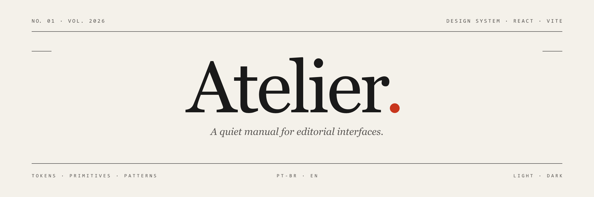

<p align="center">
  <picture>
    <source media="(prefers-color-scheme: dark)" srcset="docs/hero.dark.png" />
    <source media="(prefers-color-scheme: light)" srcset="docs/hero.png" />
    
  </picture>
</p>

<p align="center">
  <a href="https://www.npmjs.com/package/@atelier/ds"></a>
  <a href="https://www.npmjs.com/package/@atelier/cli"></a>
  <a href="https://react.dev"></a>
  <a href="./LICENSE"></a>
</p>

<p align="center">
  
  
  
  
  
  
</p>

# Atelier

> A quiet, editorial design system — a manual for interfaces that feel printed.

Atelier draws its visual language from architecture books and printed magazines: warm paper tones, dark ink, a single red used like a margin note. Two typefaces — [Fraunces][fraunces] and [JetBrains Mono][mono] — carry almost the entire hierarchy. Nothing is rounded; nothing is decorative. The product **is** the documentation: every page is the live specimen of itself.

[fraunces]: https://fonts.google.com/specimen/Fraunces
[mono]: https://fonts.google.com/specimen/JetBrains+Mono

---

## Two ways to use it

Atelier ships **two packages** that coexist by design — pick the one that matches how you want to live with it.

| Package | When to use | Install |
|---|---|---|
| [`@atelier/ds`](./packages/ds) | Traditional NPM library. Tree-shaken, types published, peer-deps `react`. You want to update from one place. | `npm install @atelier/ds` |
| [`@atelier/cli`](./packages/cli) | Shadcn-style. Copies components into your `src/`. You want to own and customize the code. | `npx atelier init` |

Both read from the same `registry.json` and stay in sync release after release.

---

## Quickstart — library mode (`@atelier/ds`)

```bash
npm install @atelier/ds react react-dom
```

```tsx
import "@atelier/ds/styles.css";
import { Button, Card, CardTitle, CardBody } from "@atelier/ds";

export function Welcome() {
  return (
    <Card>
      <CardTitle>Welcome</CardTitle>
      <CardBody>You just installed Atelier.</CardBody>
      <Button>Begin</Button>
    </Card>
  );
}
```

Sub-paths for tree-shake-friendly imports:

```ts
import { Button } from "@atelier/ds/components";
import { useFocusTrap } from "@atelier/ds/hooks";
import * as tokens from "@atelier/ds/tokens";
```

Full reference: [`packages/ds/README.md`](./packages/ds/README.md)

---

## Quickstart — CLI mode (`@atelier/cli`)

```bash
npx atelier init                      # scaffolds src/ds, src/lib/hooks, src/atelier.css
npx atelier add Button                # copies one component
npx atelier add DataTable             # also copies Combobox, DatePicker, RangeSlider, Pagination, Calendar
npx atelier add Dialog --force        # overwrites existing files
npx atelier list --category=overlay   # filters the registry
```

Zero runtime deps after the scaffold. Uninstall the CLI when you're done — your code stays. Full reference: [`packages/cli/README.md`](./packages/cli/README.md)

---

## What's inside

**59 components** and **18 hooks** are declared in [`registry.json`](./registry.json) — the same file powers the docs app, `@atelier/ds`, and `@atelier/cli`.

| Category | Components |
|---|---|
| **primitive** | Button, Input, Switch, KBD, Motion |
| **form** | Combobox, RangeSlider, Calendar, DatePicker, ColorPicker, TagInput, Form, Field |
| **layout** | Card, ResizablePanels |
| **navigation** | Tabs, Stepper, Pagination, Breadcrumbs, TreeView |
| **overlay** | Drawer, Popover, DropdownMenu, ContextMenu, Dialog |
| **data** | DataTable, MarkdownViewer, Carousel, VirtualList, Chart, Timeline, DragDrop |
| **feedback** | Toaster, Skeleton, EmptyState, Alert |

**Hooks** — `useMediaQuery`, `usePrefersReducedMotion`, `useWindowSize`, `useIntersectionObserver`, `useResizeObserver`, `useClickOutside`, `useScrollLock`, `useEventListener`, `useKeyPress`, `useLocalStorage`, `useDebounce`, `useThrottle`, `useControllableState`, `usePrevious`, `useUpdateEffect`, `useFocusTrap`, `useFocusReturn`, `useRovingTabIndex`.

Run `npx atelier list` (after installing `@atelier/cli`) to print the registry from the version on disk.

---

## The live manual

The whole codebase **is** the documentation site. Every component has a page that documents itself, with editorial decisions, props, accessibility notes and live examples.

```bash
npm install
npm run dev          # opens http://localhost:5173
```

Browse:

- `#/overview` — the cover
- `#/principles` — the six rules
- `#/install` and `#/cli` — both consumption modes
- `#/api-reference` — what lives where
- `#/recipes` — ready-to-paste compositions, opens in StackBlitz/CodeSandbox
- `#/roadmap` — what's done, what's next
- `⌘/Ctrl + K` — fuzzy search across every page

---

## Repo structure

```
atelier/
├── src/                       # the live manual (the app you see at atelier-ds.com)
│   ├── App.tsx                # shell: sidebar/navbar + content + footer
│   ├── ds/                    # 59 components — single source of truth
│   ├── lib/                   # hooks, i18n, theme, routes, registry helpers
│   ├── pages/                 # documentation pages (82 routes in routes.ts)
│   ├── i18n/{pt-BR,en}.ts     # bilingual dictionaries
│   └── index.css              # tokens + every component style
│
├── packages/
│   ├── ds/                    # @atelier/ds — library mode (Vite library + dts)
│   └── cli/                   # @atelier/cli — shadcn-style CLI (zero deps)
│
├── registry.json              # 59 components + 18 hooks, single source of truth
├── scripts/
│   ├── vite-plugin-sitemap.mjs
│   └── vite-plugin-sw.mjs     # service worker — full offline support
│
└── public/
    ├── favicon.svg            # theme-aware monogram At.
    ├── manifest.webmanifest   # PWA
    ├── robots.txt · humans.txt · sitemap.xml
    └── .well-known/security.txt
```

---

## Stack

- **React 18** + **Vite 5** — no external router (lightweight hash routing).
- **TypeScript 6**, **plain CSS** with custom properties as design tokens.
- **Vitest 4** for unit tests (42 specs).
- **PWA** — manifest + service worker; build pre-caches documented routes and static assets for offline use.
- **Zero runtime dependencies** beyond `react` and `react-dom` — no framer-motion, no date-fns, no Radix under the hood.

---

## Highlights

- **Bilingual by default** — `pt-BR` and `en` dictionaries, swappable at runtime via `useT()`. Lightweight markup parsing (`[em]`, `[acc]`) for inline emphasis inside translations.
- **Two themes** — `light` and `dark`. First visit follows the OS `prefers-color-scheme`; every choice after is persisted in `localStorage`.
- **Two navigation modes** — vertical **sidebar** (default, `⌘/Ctrl + B` to toggle) or horizontal **navbar** with hover dropdowns. The user toggles between them; the preference is persisted.
- **Per-user `NEW` badge** — pages marked new in `routes.ts` show a `NEW` badge in nav until the user visits them. Persisted in `localStorage`, syncs across tabs.
- **Full PWA** — installable, works offline. Service worker pre-caches every route + assets at build time.
- **Fully accessible** — visible focus, contrast ≥ 4.5:1, keyboard parity with mouse, ARIA-complete overlays, focus traps in modals/drawers.

---

## Scripts

```bash
# App
npm run dev                # start dev server
npm run build              # build app to dist/ (sitemap + SW generated)
npm run preview            # preview production build
npm run typecheck          # tsc --noEmit
npm test                   # vitest run (42 specs)

# Packages
npm run build:ds           # build @atelier/ds (vite library + dts)
npm run pack:ds            # npm pack the tarball
npm run smoke:ds           # full smoke: pack + sandbox install + 10 checks

npm run build:cli          # build @atelier/cli (sync sources)
npm run pack:cli           # npm pack the tarball
npm run smoke:cli          # full smoke: pack + sandbox + 10 checks

# CLI
npm run cli                # run the local CLI: node packages/cli/bin/atelier.js
```

---

## Contributing

We welcome contributions — particularly editorial copy, accessibility audits, and component refinements. Read [`CONTRIBUTING.md`](./CONTRIBUTING.md) before opening a PR.

By participating, you agree to abide by our [Code of Conduct](./CODE_OF_CONDUCT.md).

For security disclosures, see [`SECURITY.md`](./SECURITY.md). Do **not** open public issues for vulnerabilities.

Maintainers publishing to npm: [`docs/PUBLISHING.md`](./docs/PUBLISHING.md).

---

## Roadmap

The active roadmap lives at [`#/roadmap`](https://atelier-ds.com/#/roadmap) — phases, priorities, dependencies, what's done. Snapshot:

- **Phase 14 — Distribution & web standards**: in progress. SEO, sitemap, PWA, `@atelier/ds`, `@atelier/cli`, GitHub presence (this).
- **Phase 15+ — Components & patterns deepening**: TBD. New primitives, advanced patterns.

---

## Origin

The project began as a small CSV-to-JSON converter. That original component still lives, quietly, on the [`#/dropzone`](https://atelier-ds.com/#/dropzone) page — the seed from which everything else grew.

---

## License

[MIT](./LICENSE) — use it, fork it, ship it. Attribution appreciated, not required.

The Atelier wordmark logo is the only exception: it stays with the project. See [`#/license`](https://atelier-ds.com/#/license) for the full editorial annotations.
